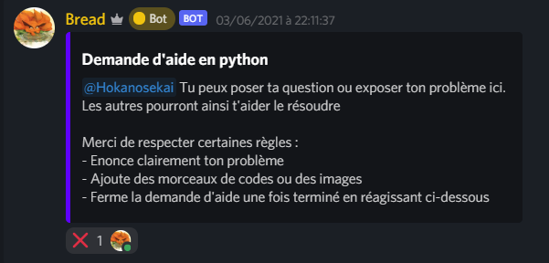

# Bread
 
## Bot privé de Ticket et autre.

Ce bot a plusieurs fonctionalités :  
-  #### une commande de clear : 
Cette commande permet de supprimer un certain nombres de messages dans le channel d'éxecution de la commande
> [prefix]clear [int < 99]     (£clear 50)

- #### une commande code : `En cours`
Cette commande a pour but de simplifier l'écriture de code en unse seule ligne  

- #### un système de demande d'aide via ticket :
Réagissez sur un message en sélectionant le langage. Le bot créera ainsi un channel (text) dans la catégorie Tickets En Cours.  
Dans ce salon vous pourrez exposer votre problème.

Une fois ton problème énoncer les gens pourront t'aider. Lorsque ton problème est résolu réagit sur la croix pour fermer ta demande d'aide.  
Ta demande sera automatiquement archivé dans une catégorie Tickets Fermés

by zyksa, Hokanosekai  
Bread - © 2021